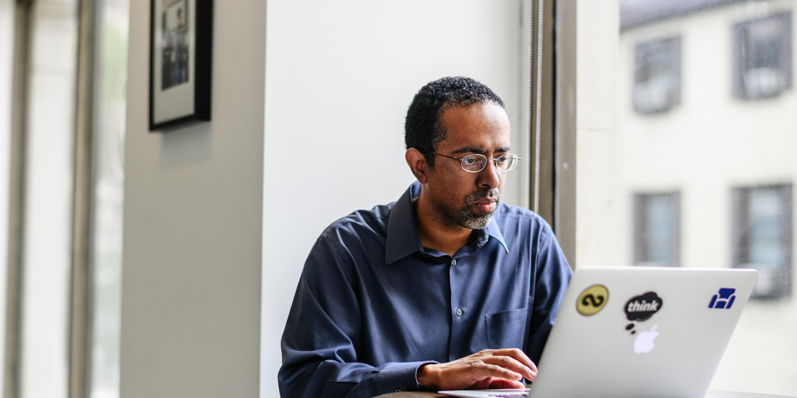

Last year I gave over 15 talks. This year I’ve given six already, and was slated to do many more. Then… [stuff happened](https://www.cdc.gov/coronavirus/2019-ncov/index.html). Some of those speaking opportunities got shifted to next year. Some presentations turned virtual. And some new ones appeared out of nowhere. So this year hasn’t turned into the story of not giving talks so much as it has become the story of giving talks differently.

Of the six presentations I’ve given already, four of them have been virtual. Two by design, and two by way of turning lemons into lemonade. In February, I presented remotely to [18F](https://18f.gsa.gov/), a government organization delivering amazing UX and content strategy experiences to government websites. This is a workforce that is distributed by nature. The only way I was going to present to them was going to be virtual.

Then there was Mule Design’s [Quarantine Book Club](https://www.quarantinebookclub.com/), which appeared in the wake of the Coronavirus outbreak as a means of getting together in spite of social distancing. They are hosting ongoing Zoom meetings where authors answer participants’ questions live. I had the pleasure of being on one of these meetings and it was an amazing experience.

The other two—a presentation for SXSW and another for Temple’s Innovation Leaders Speaker Series—went virtual, and actually turned out pretty well. The SXSW talk turned into the first entry into the Think Company webinar series, [Turning Conflict into Collaboration Using Content Strategy](https://thinkcompany.zoom.us/rec/play/uMcvJO7-_Gk3HIDHsQSDBqd8W9Tuf6KsgCkW8_oNnkvmUiYLNwXyZbdEN-tpE6boaFUlNOP6YXE1mkke). The Temple live event became a live webinar, which could handle a bigger (and certainly more international) turnout than the live event ever could have.

We’re going to see more of these shifts to webinars and virtual presentations in the days to come. It is a time of experimentation by necessity, and some of those experiments are going to pay off in unexpected ways. It doesn’t happen often, but there are moments in history where lots of people’s needs shift in the same direction at the same time. This is one of those moments.

So what does that shift mean for folks who used to present in person but now have to present remotely? Like I said, I do a lot of public speaking, and sometimes I do public speaking about public speaking, and a lot of the advice I’d offer hasn’t changed. You have to prepare. You have to over-rehearse so that when the time comes you’re not focusing on remembering what comes next. But there are some key skills needed for an effective virtual presentation that are worth highlighting here.

## Best Practices for Online Presentations and Webinars

### 1. Don’t go it alone

When using a platform like Zoom to present remotely, it helps immensely to have someone else moderating. During an online presentation, the moderator is doing things like…

- Giving participants the “ground rules” (stay on mute, here’s how to ask a question, etc.) at the beginning
- Introducing the speaker
- Monitoring the chat or the Q&A section and either asking their questions at the appropriate time or “throwing to them” by unmuting them so they can ask their questions themselves

Basically, the moderator is the person in the van taking care of all the technical and emcee details in the background so the speaker can focus on their talk and interacting with the participants.

### 2. Slow down

Usually when I give a talk, I can focus on the audience to gauge how fast I should be going and whether or not the audience is engaged or tuning out. My greatest frustration with presenting online is that I can’t see the audience. More often than not, I’m staring at my own presentation or my own face and talking as if there’s an audience there in the room with me. It feels more like radio than presenting.

Without those visual cues I have to assume that audiences aren’t following along, just in case they aren’t. I have to remind myself to slow down in case my usual rapid cadence—that I could otherwise modulate based on the feedback I’m getting from the audience—isn’t appropriate. So if I seem to speak a little more slowly and a little more carefully when I present remotely, that’s why.

### 3. Put the light in front of you

We have a much more detailed post coming about how to light yourself well when participating in an online presentation, but the dead simple rule is this: make sure the source of light in the room is in front of you. If it’s behind you, you’ll look like you’re in the witness protection program.

_Light behind_

_Light in front_

### 4. Make sure there’s time for Q&A

Because the virtual style of webinars and online presentation means you don’t get that interaction during the talk (or the format makes it much more disruptive), it’s all the more important to set aside time to talk to the participants and have a conversation because they can’t just walk up to you afterwards to chat. So leave at least 15 minutes after your presentation for questions from participants at the end of the session. And make sure to establish the rules early on for how to accept questions. Will the moderator read them? Will they unmute the person who’s asking? How will people signal they have a question? Chat? Q&A? A “raise your hand” tool? It doesn’t matter which approach you choose so long as it’s clear from the start for everyone involved what the protocol is going to be.

### 5. Give leave-behinds

I usually have something like a link to a newsletter to drop into the chat at the end of a webinar or presentation so that if people do wanna keep in touch or keep up with what I’m up to, they can. It’s also a good idea to send a follow up email to registrants with a recording of the presentation or webinar (if possible) and some resources related to the talk (as well as opportunities to keep in touch, such as the aforementioned newsletter or contact info). Webinars and remote presentations go by fast, and folks can’t always take all the notes they want, so making it easier for them is usually a good idea.

(Speaking of which, if you do want to get updates on the book I’m writing about design for cognitive bias, [there’s a newsletter for that](https://thinkpo.st/DaveBookList).)

### 6. If you’re comfortable, make yourself available in the future

I’m the kind of speaker who likes to hang out after and chat with folks and sometimes grab coffee with them at some later point. This is not to every speaker’s taste, so I’m not making this a hard and fast rule, but if you enjoy that sort of interaction and would like to replicate it digitally, consider offering a “virtual coffee” as an option. You can set up an intake form pretty quickly using Google Forms or Airtable and ask for a name and what the person would like to talk about. It doesn’t have to be very detailed. Then there are any number of scheduling options after that (Calend.ly, Doodle, etc.). It’s a nice touch to stay connected in a disconnected time.

[Here’s mine, if you’re interested](https://thinkpo.st/VirtualCoffeeDave).

I hope you find these virtual presentation and speaking tips helpful. Best of luck in this time of staying connected while staying far apart.
