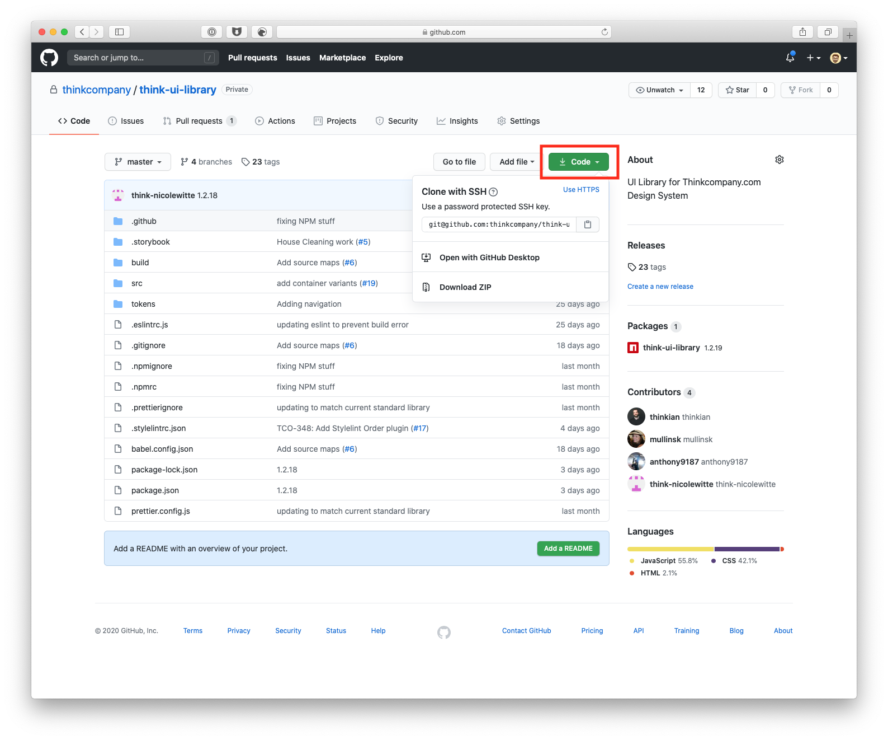
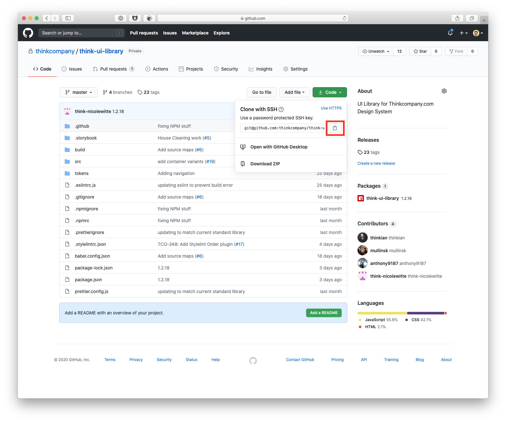
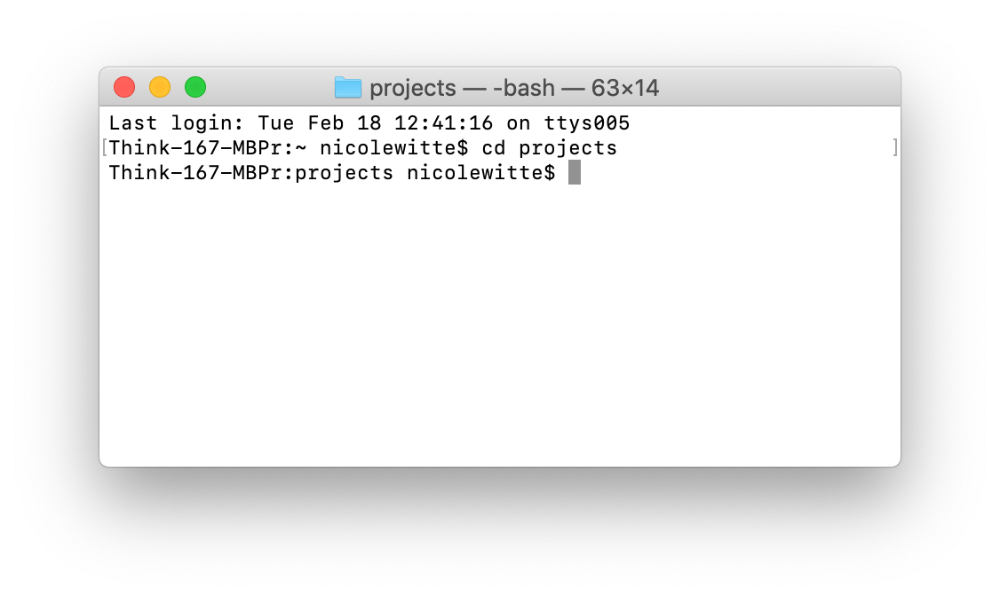
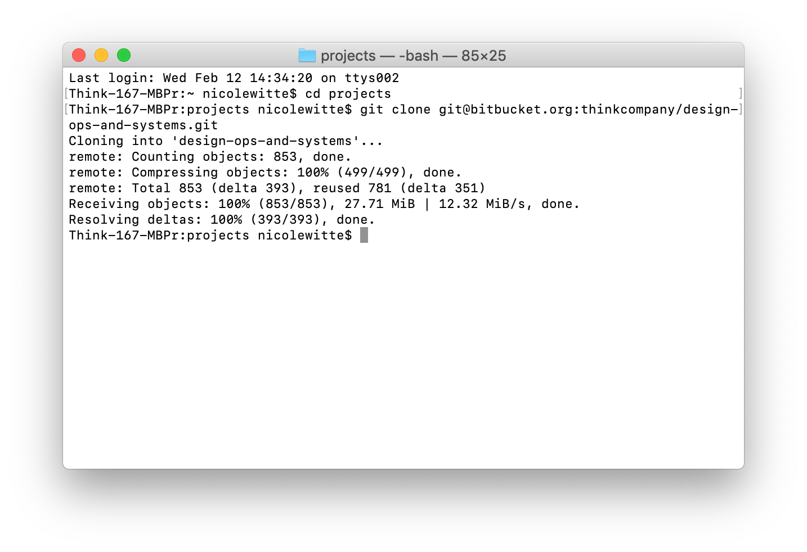
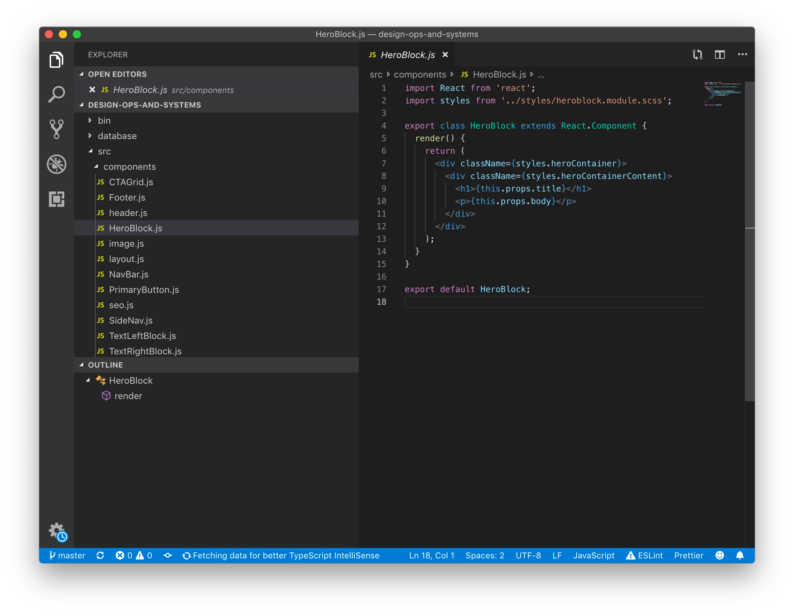

## Get A Github Account

The first thing you’ll need to do is get a free <a href="https://github.com" target="_blank">Github</a> account.

---

## Setup SSH

The second thing you’ll need to do is decide how you are going to clone this repository. There are two ways to clone a project: SSH and HTTPS. You can read more about it on <a href="https://help.github.com/en/github/using-git/which-remote-url-should-i-use" target="_blank">Github’s help site</a>, but the most important, basic thing you’ll need to know is this:

- using HTTPS requires your Github username and password every time you `git fetch`, `git pull`, or `git push`
- using SSH will forgo your username and password, but you’ll need to <a href="https://docs.github.com/en/github/authenticating-to-github/generating-a-new-ssh-key-and-adding-it-to-the-ssh-agent" target="_blank">generate an SSH key first</a>

What does this mean? HTTPS will be easier upfront, but you will have to enter your u/p every time. SSH will be harder upfront, but you will never have to enter your u/p again (probably).

If you’d like to generate an SSH key, <a href="https://docs.github.com/en/github/authenticating-to-github/generating-a-new-ssh-key-and-adding-it-to-the-ssh-agent" target="_blank">follow these instructions</a> (also linked above) to generate one using your terminal. Otherwise, jump to Step 1. After you’ve done that, follow <a href="https://docs.github.com/en/github/authenticating-to-github/adding-a-new-ssh-key-to-your-github-account" target="_blank">these instructions</a> to add it to your Github account.

---

## Clone Project

Now you’re ready to clone your first project.

### Step 1

Locate the project on Github and click the clone button

### Step 2

Copy the command from Github (if you haven’t generated an SSH key, you’ll have to change the SSH option to HTTPS)

### Step 3

Open your terminal and <a href="https://macpaw.com/how-to/use-terminal-on-mac" target="_blank">cd into the folder</a> you’d like to place this new project (I put all of my projects in a “projects” folder inside my main directory)

### Step 4

Copy the command from Github into your command line, the results should look like this

### Step 5

Open your text editor of choice. We recommend <a href="https://code.visualstudio.com/#alt-downloads" target="_blank">VSCode</a>.

### Step 6

You have officially cloned your first project and you are ready to make some changes. Finally before you go, remember to make a new branch first!
