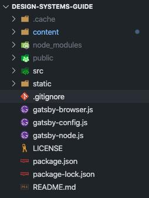
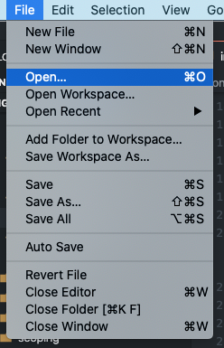
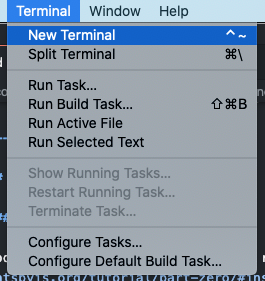
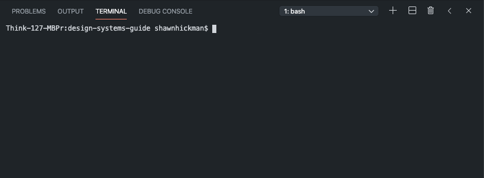

### Add a .gitignore file

When using Git, there are certain files you don't want to commit. You want Git to ignore them. Before installing your dependencies, you'll want to create a `.gitignore` file at the root level (main or parent level) of your project.



1. Create a new file in VSCode.
2. Name the file `.gitignore`
3. Copy and paste the contents below into that file and save it

Now, all of the files and folders listed below will be ignored by Git.

```shell
# gatsby files
.cache/
public/

# Mac files
.DS_Store

# Output of 'npm pack'
*.tgz

# Dependency directories
node_modules/
```

---

### What Are Dependencies?

A Gatsby site comes with a bunch of dependencies. These dependencies are little libraries that add specific functionality to the site. For example, we use a dependency called `gatsby-remark-prismjs` that allows us to embed nicely formatted code blocks into our markdown files. You can see all the dependencies for this project in the `package.json` file.

**PrismJS Code Block**

```swift
//Swift example
func someFunction(name: String, age: Int) {
	//Do something
}
```

Cool beans!

---

### How to Install the Dependencies

First, open VSCode. Once open, you want to bring in your project files. You can do this by going to _File > Open_ and select the folder the files are located in.



Next, open the terminal in VSCode. You can do this by going to _Terminal > New Terminal_. You should now have a new terminal panel open in VSCode.





In the terminal type `npm install`. This will install all the necessary dependencies. You'll notice the terminal going crazy while this is happening. Don't worry, that is normal. At this point, you're probably feeling like quite the hacker. Nice work 👩🏾‍💻.
